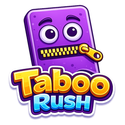
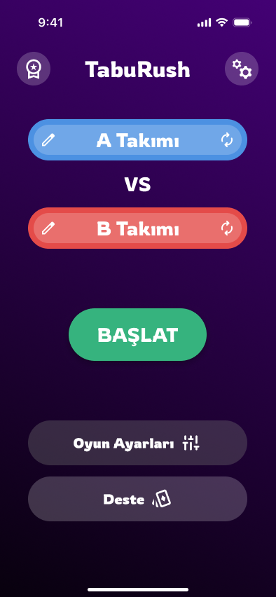
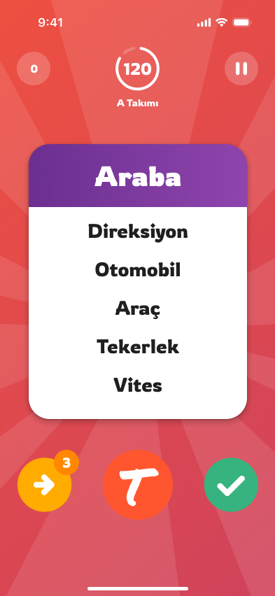
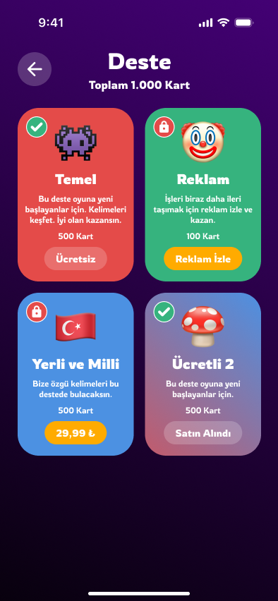

# Hi there, I'm Celil 👋

### Android Mobile Developer · Kotlin · KMP

I build native Android apps and share logic across platforms with **Kotlin Multiplatform**.  
Currently shipping mobile products at **[Kuka Apps](https://www.linkedin.com/company/kuka-apps)** · İzmir, Türkiye.

---

## Tech Stack

  
  
  
  
  

- **Languages:** Kotlin, Java  
- **Android:** Jetpack, Compose, MVVM, Clean Architecture, Flow  
- **Cross-platform:** Kotlin Multiplatform (KMP)  
- **Networking & DI:** Retrofit, Ktor, Hilt / Koin  

---

## Project — [TabuRush](https://taboo-game-emce.web.app/)

  

**TabuRush — Yasaklı Kelimeler**, arkadaşlarınla oynadığın hızlı bir taboo / kelime anlatma oyunu.  
Takımını kur, süreyi yakala, yasaklı kelimeleri kullanmadan anlat — 2.500+ kart, modern arayüz, App Store & Google Play’de.

  
  &nbsp;
  

  
  
  

---

## Connect

